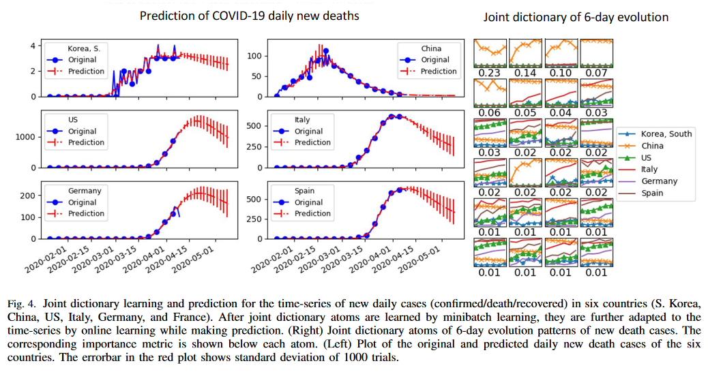

# ONMF-COVID19
Time series applications of onlien NMF on COVID19 data sets \
Learns dictionary atoms for short time-evolution patterns of multiple countries or counties, and uses them to predict future values

## References

These codes are based on my paper below: 
  1. Hanbaek Lyu, Christopher Strohmeier, Deanna Needell, and Georg Menz, 
     “COVID-19 Time Series Prediction by Joint Dictionary Learning and Online NMF” 
     https://arxiv.org/abs/(will be announced shortly)

## File description 

  1. **ontf.py** : Online Nonnegative Tensor Factorization algorithm (generalization of onmf to the tensor setting by folding/unfolding operation)
  2. **time_series_ONMF_COVID19.py** : Main file implementing ONMF to COVID-19 time-series data  
  3. **main.py** : Tune hyperparameters and execute main files

## Usage
  1. git clone this repository
  2. git clone https://github.com/CSSEGISandData/COVID-19 inside ONMF-COVID19
  3. run main.py 
  
## Authors

* **Hanbaek Lyu** - *Initial work* - [Website](https://hanbaeklyu.com)

## License

This project is licensed under the MIT License - see the [LICENSE.md](LICENSE.md) file for details
